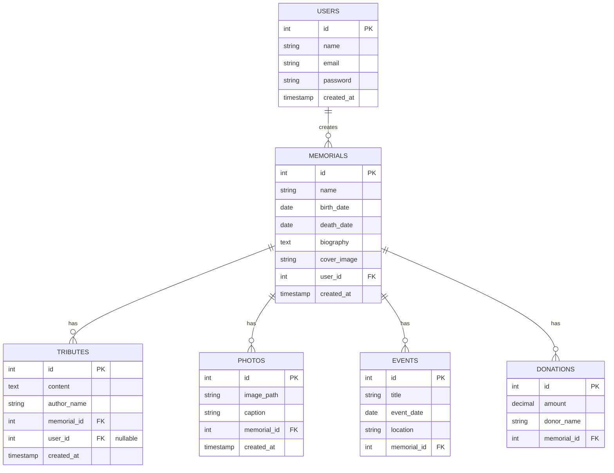

# First version of the Database:

# The ER diagram:

# 1st version of code to be edited later on:

erDiagram
USERS ||--o{ MEMORIALS : "creates"
MEMORIALS ||--o{ TRIBUTES : "has"
MEMORIALS ||--o{ PHOTOS : "has"
MEMORIALS ||--o{ EVENTS : "has"
MEMORIALS ||--o{ DONATIONS : "has"

    USERS {
        int id PK
        string name
        string email
        string password
        timestamp created_at
    }

    MEMORIALS {
        int id PK
        string name
        date birth_date
        date death_date
        text biography
        string cover_image
        int user_id FK
        timestamp created_at
    }

    TRIBUTES {
        int id PK
        text content
        string author_name
        int memorial_id FK
        int user_id FK "nullable"
        timestamp created_at
    }

    PHOTOS {
        int id PK
        string image_path
        string caption
        int memorial_id FK
        timestamp created_at
    }

    EVENTS {
        int id PK
        string title
        date event_date
        string location
        int memorial_id FK
    }

    DONATIONS {
        int id PK
        decimal amount
        string donor_name
        int memorial_id FK
    }