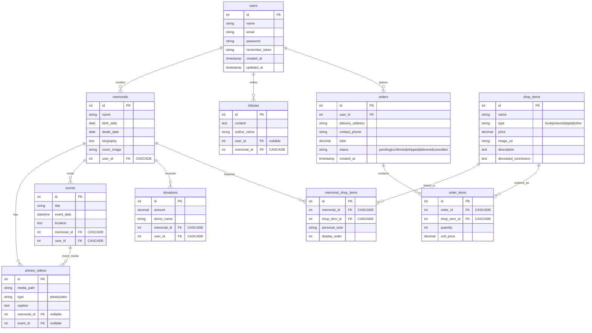

# Second version of the Database:

# The ER diagram:

    # MYSQL code:

    users {
        int id PK
        string name
        string email
        string password
        string remember_token
        timestamp created_at
        timestamp updated_at
    }

    memorials {
        int id PK
        string name
        date birth_date
        date death_date
        text biography
        string cover_image
        int user_id FK "CASCADE"
    }

    photos_videos {
        int id PK
        string media_path
        string type "photo|video"
        text caption
        int memorial_id FK "nullable"
        int event_id FK "nullable"
    }

    events {
        int id PK
        string title
        datetime event_date
        text location
        int memorial_id FK "CASCADE"
        int user_id FK "CASCADE"
    }

    tributes {
        int id PK
        text content
        string author_name
        int user_id FK "nullable"
        int memorial_id FK "CASCADE"
    }

    donations {
        int id PK
        decimal amount
        string donor_name
        int memorial_id FK "CASCADE"
        int user_id FK "CASCADE"
    }

    shop_items {
        int id PK
        string name
        string type "book|artwork|digital|other"
        decimal price
        string image_url
        text description
        text deceased_connection
    }

    memorial_shop_items {
        int id PK
        int memorial_id FK "CASCADE"
        int shop_item_id FK "CASCADE"
        string personal_note
        int display_order
    }

    orders {
        int id PK
        int user_id FK
        string delivery_address
        string contact_phone
        decimal total
        string status "pending|confirmed|shipped|delivered|cancelled"
        timestamp created_at
    }

    order_items {
        int id PK
        int order_id FK "CASCADE"
        int shop_item_id FK "CASCADE"
        int quantity
        decimal unit_price
    }

### Database Constraints
- **Foreign Keys**:
    - `donations.user_id` → `users.id`
    - `donations.memorial_id` → `memorials.id`
    - `events.user_id` → `users.id`
    - `photos_videos.memorial_id` → `memorials.id`
    - `photos_videos.event_id` → `events.id`

- **Indexes**:
    - `idx_donations_user_id` (`donations.user_id`)
    - `idx_photos_memorial` (`photos_videos.memorial_id`)
    - `idx_events_user` (`events.user_id`)
