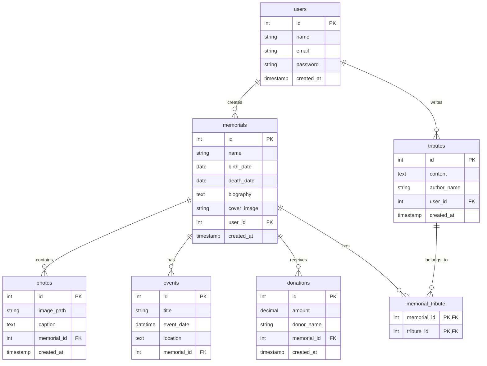

# First version of the Database:

# The ER diagram:

# 1st version of code to be edited later on:

-- 1. Create users table (for admins/family)
CREATE TABLE users (
id INT AUTO_INCREMENT PRIMARY KEY,
name VARCHAR(255) NOT NULL,
email VARCHAR(255) UNIQUE NOT NULL,
password VARCHAR(255) NOT NULL,
created_at TIMESTAMP DEFAULT CURRENT_TIMESTAMP
);

-- 2. Create memorials table (deceased profiles)
CREATE TABLE memorials (
id INT AUTO_INCREMENT PRIMARY KEY,
name VARCHAR(255) NOT NULL,
birth_date DATE NOT NULL,
death_date DATE NOT NULL,
biography LONGTEXT,
cover_image VARCHAR(255),
user_id INT NOT NULL,
created_at TIMESTAMP DEFAULT CURRENT_TIMESTAMP,
FOREIGN KEY (user_id) REFERENCES users(id) ON DELETE CASCADE
);

-- 3. Create tributes table (messages for the deceased)
CREATE TABLE tributes (
id INT AUTO_INCREMENT PRIMARY KEY,
content LONGTEXT NOT NULL,
author_name VARCHAR(255) NOT NULL,
user_id INT,
created_at TIMESTAMP DEFAULT CURRENT_TIMESTAMP,
FOREIGN KEY (user_id) REFERENCES users(id) ON DELETE SET NULL
);

-- 4. Create memorial_tribute pivot table (many-to-many)
CREATE TABLE memorial_tribute (
memorial_id INT NOT NULL,
tribute_id INT NOT NULL,
PRIMARY KEY (memorial_id, tribute_id),
FOREIGN KEY (memorial_id) REFERENCES memorials(id) ON DELETE CASCADE,
FOREIGN KEY (tribute_id) REFERENCES tributes(id) ON DELETE CASCADE
);

-- 5. Create photos table (memorial galleries)
CREATE TABLE photos (
id INT AUTO_INCREMENT PRIMARY KEY,
image_path VARCHAR(255) NOT NULL,
caption TEXT,
memorial_id INT NOT NULL,
created_at TIMESTAMP DEFAULT CURRENT_TIMESTAMP,
FOREIGN KEY (memorial_id) REFERENCES memorials(id) ON DELETE CASCADE
);

-- 6. Create events table (funeral/memorial events)
CREATE TABLE events (
id INT AUTO_INCREMENT PRIMARY KEY,
title VARCHAR(255) NOT NULL,
event_date DATETIME NOT NULL,
location TEXT NOT NULL,
memorial_id INT NOT NULL,
FOREIGN KEY (memorial_id) REFERENCES memorials(id) ON DELETE CASCADE
);

-- 7. Create donations table (charity gifts)
CREATE TABLE donations (
id INT AUTO_INCREMENT PRIMARY KEY,
amount DECIMAL(10,2) NOT NULL,
donor_name VARCHAR(255) NOT NULL,
memorial_id INT NOT NULL,
created_at TIMESTAMP DEFAULT CURRENT_TIMESTAMP,
FOREIGN KEY (memorial_id) REFERENCES memorials(id) ON DELETE CASCADE
);