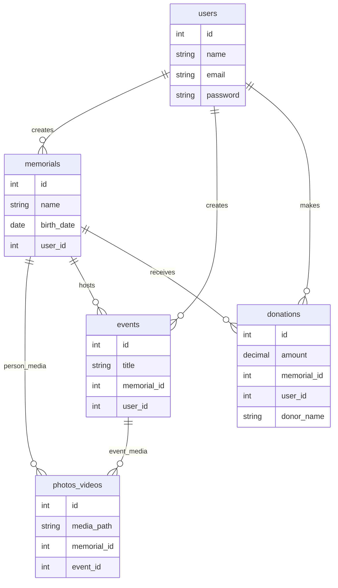

# Second version of the Database:

# The ER diagram:

    # MYSQL code:

users {
int id
string name
string email
sting password
}

    memorials {
        int id
        string name
        date birth_date
        int user_id
    }

    photos_videos {
        int id
        string media_path
        int memorial_id
        int event_id
    }

    events {
        int id
        string title
        int memorial_id
        int user_id
    }

    donations {
        int id
        decimal amount
        int memorial_id
        int user_id
        string donor_name
    }

### Database Constraints
- **Foreign Keys**:
    - `donations.user_id` → `users.id`
    - `donations.memorial_id` → `memorials.id`
    - `events.user_id` → `users.id`
    - `photos_videos.memorial_id` → `memorials.id`
    - `photos_videos.event_id` → `events.id`

- **Indexes**:
    - `idx_donations_user_id` (`donations.user_id`)
    - `idx_photos_memorial` (`photos_videos.memorial_id`)
    - `idx_events_user` (`events.user_id`)
